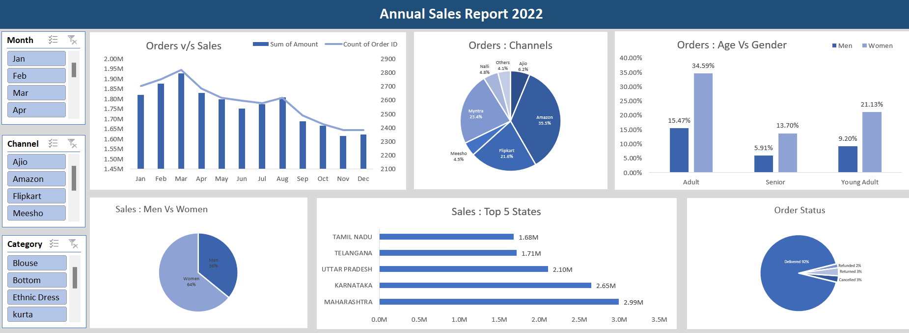

# Excel Data Analysis

📊 **Project Overview:**
- 🚀 **Introduction:** This project involved a comprehensive analysis of our sales data for the year 2022.
- 🎯 **Objective:** The primary objectives were to forecast sales for 2023 and create a sales report to enhance customer understanding and drive business growth.

📋 **Methods:**
- 🧹 **Data Cleaning:**
  - Checked for null values and found none.
  - Verified no duplicate values in category columns.
  - Standardized gender column from 'M' and 'W' to 'Men' and 'Women.'
  - Resolved inconsistencies in the quantity column.

- 📦 **Data Processing:**
  - Grouped customers into three age categories: Young Adult, Adult, and Senior.
  - Extracted months from the "Date" column for improved data representation.

📈 **Data Analysis:**
- 📊 Created pivot tables for data aggregation.
- 📊 Produced multiple charts to visualize data insights.

📱 **Interactive Dashboard:**
- 📲 Added slicers to charts for user interactivity.
- 📲 Enabled report connections for seamless chart synchronization.

🧩 **Conclusions:**
- 💡 Sales were highest in April, suggesting a focus on that month for marketing initiatives.
- 🌐 Majority of sales were through Amazon and Myntra, recommending further investment in these platforms.
- 🚺 Women placed most orders, particularly in the age range of 30-49.
- 🌍 Top-performing states were Maharashtra, Uttar Pradesh, and Karnataka.
- ✅ Majority of orders were delivered, indicating an efficient order fulfillment process.
